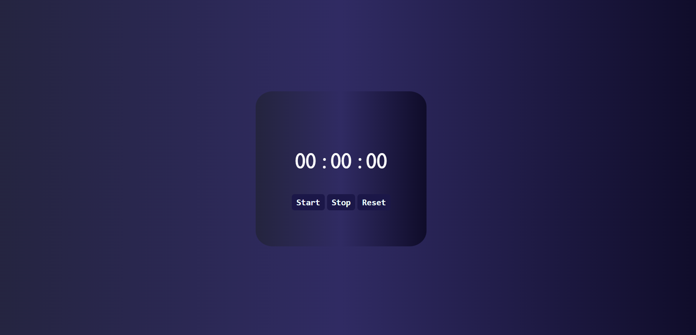

# Stop-watch using JavaScript

Attractive stop watch developed and designed for my assignment in iNeuron. By building this assignment I've learned how to work with setTimeout, setInterval and stopTimeout methods.

## App Screenshot

[Live Demo 🔗](https://parveshahamed-stop-watch.netlify.app/)

## Tools I've used

 

 

 

## 🚀 About Me

 Student graduating BSc Information Technology, Aspiring young Fullstack Developer🧑‍💻.
